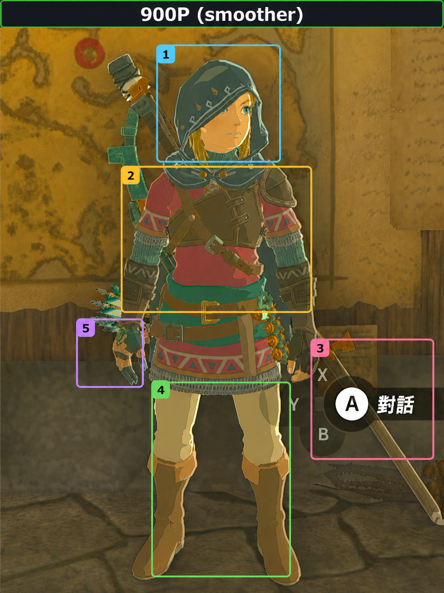
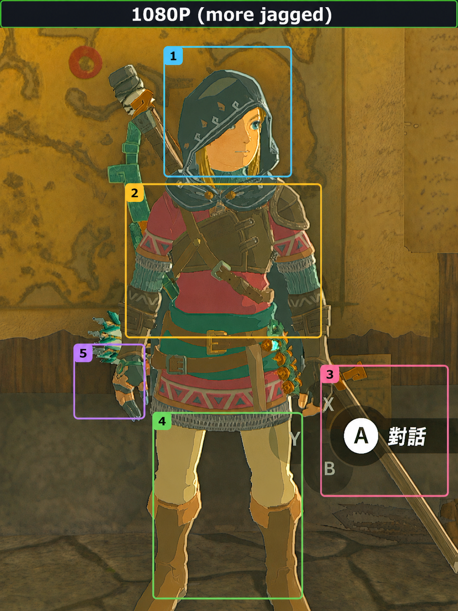
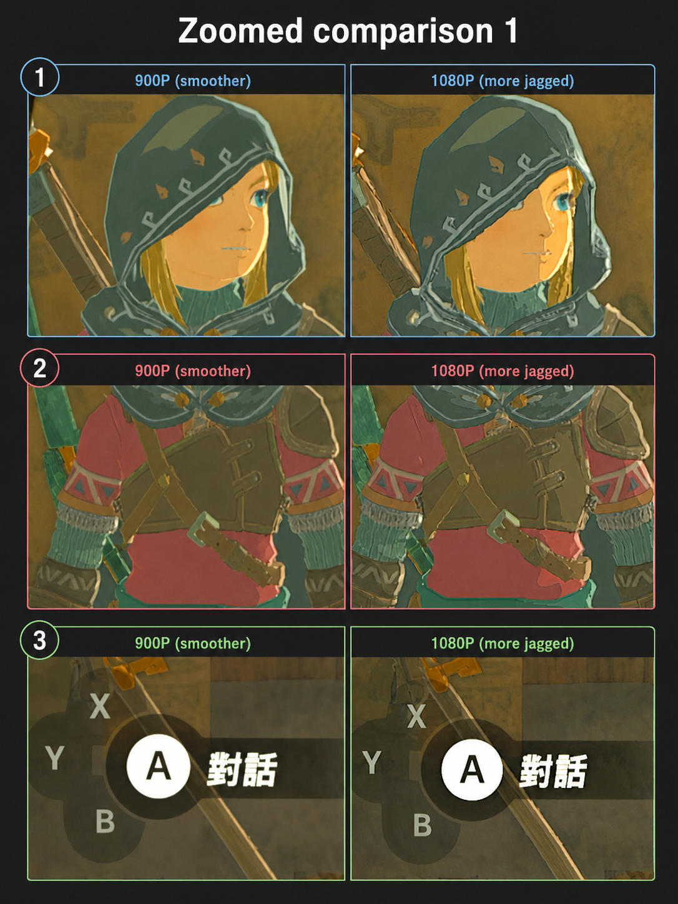
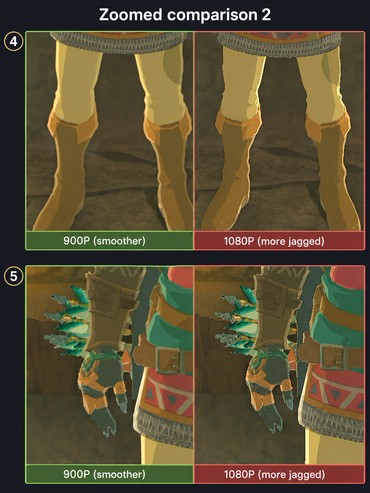

# OBS Canvas Rescaler

Browser-based canvas resolution switcher for **OBS Virtual Camera**.

OBS Canvas Rescaler opens your OBS Virtual Camera stream in a browser, optionally rescales the stream through an HTML canvas, and displays the selected output resolution for fullscreen viewing or browser-side video processing.

Everything runs locally in your browser. No video is sent by this tool.

## Why this exists

Some capture sources output a clean 1080p signal, but the actual rendered image inside that signal may be lower than 1080p or may already contain visible aliasing from an earlier scale pass.

If a browser-side video processing pipeline receives that already-upscaled 1080p image directly, it may preserve or emphasize jagged edges as if they were real detail.

This tool lets you quickly compare different effective input resolutions, such as 900p, 810p, 720p, 648p, 600p, 576p, 540p, and 480p, without changing the OBS canvas every time.

The goal is not always to use the highest input resolution. In some cases, a slightly lower canvas resolution can reduce aliasing and produce a cleaner final image.

## Visual comparison

The following images show one example where a 900p canvas output gives smoother edges than a direct 1080p input.

| 900p canvas output | 1080p direct input |
| --- | --- |
|  |  |

### Zoomed comparison





## Features

- Opens OBS Virtual Camera directly by device ID.
- Does not require changing the browser's default camera.
- Direct mode for the original OBS Virtual Camera stream.
- Canvas output presets:
  - 1080p / 900p / 810p / 720p / 648p / 600p / 576p / 540p / 480p / 360p
  - additional fine-tuning presets between common targets.
- Canvas downscale quality:
  - High
  - Medium
  - Low
  - Nearest
- Fullscreen mode.
- Hideable UI overlay.
- Keyboard shortcuts.

## Requirements

- OBS Studio with OBS Virtual Camera.
- A Chromium-based browser or another browser that supports camera permissions and `canvas.captureStream()`.
- Python 3 for the included local server scripts.
- Windows is recommended for the included `.bat` launch scripts.

## OBS setup

### 1. Set the OBS video canvas

Open OBS, then go to:

```text
Settings -> Video
```

Recommended settings for a 1080p capture source:

```text
Base (Canvas) Resolution: 1920x1080
Output (Scaled) Resolution: 1920x1080
Downscale Filter: Bicubic or Lanczos
Common FPS Values: 60
```

The tool is designed to receive a clean OBS Virtual Camera feed first. Do the resolution switching in the browser tool, not by changing the OBS canvas every time.

### 2. Add your capture source

In OBS:

```text
Sources -> + -> Video Capture Device
```

Choose your capture card or camera device.

For a 1080p60 capture card, start with:

```text
Resolution/FPS Type: Custom
Resolution: 1920x1080
FPS: 60
Video Format: YUY2 or NV12
Color Space: Rec.709
Color Range: Limited
```

If the image looks washed out or crushed, check that the source device, OBS, and display path use compatible color-range settings.

### 3. Fit the source to the canvas

Right-click the capture source in OBS:

```text
Transform -> Fit to Screen
```

Avoid adding sharpening filters or extra scaling filters in OBS while comparing resolution presets. Start with a clean source, then adjust later if needed.

### 4. Start OBS Virtual Camera

Click:

```text
Start Virtual Camera
```

Keep OBS open while using the browser tool.

## Browser setup

### 1. Extract the project folder

Download and extract the release ZIP.

Do not open `index.html` directly through `file://`. Browser camera permissions and device names are more reliable when the page is served from localhost.

### 2. Start the local server

Run one of these files:

```text
start-localhost-default-browser.bat
start-localhost-edge-new-tab.bat
```

A command prompt window will open. Keep it open while using the tool.

The browser should open:

```text
http://127.0.0.1:8777/
```

### 3. Allow camera permission

When the browser asks for camera permission, allow it.

If the camera list still does not show device names, reload the page after granting permission.

### 4. Start the video

Click:

```text
Start
```

The tool will try to find OBS Virtual Camera automatically.

If it does not, use the camera dropdown and choose OBS Virtual Camera manually.

### 5. Choose an output mode

Use the resolution dropdown:

```text
Direct OBS input
1080p
900p
810p
720p
648p
600p
576p
540p
480p
360p
```

General guidance:

```text
Direct OBS input: no canvas rescaling.
1080p: keeps the original 1080p source size.
900p: useful when a source looks too jagged at direct 1080p.
720p: useful for lower effective-resolution content or UI-style sources.
540p / 480p / 360p: useful for stronger rescaling comparisons or low-resolution sources.
```

### 6. Choose downscale quality

Use the downscale dropdown:

```text
High
Medium
Low
Nearest
```

Meaning:

```text
High: smoothest canvas resampling.
Medium: balanced smoothing.
Low: lighter smoothing.
Nearest: no smoothing; keeps harder pixel edges.
```

If the image becomes too soft, try:

```text
900p + Medium
900p + Low
936p + High
972p + High
Nearest
```

### 7. Enter fullscreen

Click:

```text
Fullscreen
```

The video output will enter fullscreen. Press `Esc` to exit fullscreen.

## Keyboard shortcuts

```text
F: Fullscreen
H: Hide or show UI
0: Direct OBS input
1: 1080p
2: 900p
3: 720p
4: 648p
5: 600p
6: 576p
7: 540p
8: 480p
```

## Troubleshooting

### OBS Virtual Camera is not found

Check:

```text
1. OBS is open.
2. OBS Virtual Camera is started.
3. Browser camera permission has been allowed.
4. No other app is exclusively using OBS Virtual Camera.
```

Then press:

```text
Refresh
```

### Device names are hidden

Browser device names may stay hidden before camera permission is granted.

Allow camera permission, then reload the page.

### The camera fails to start

Close other apps or browser tabs that may be using OBS Virtual Camera.

Then:

```text
1. Stop OBS Virtual Camera.
2. Start OBS Virtual Camera again.
3. Reload the browser page.
4. Press Start.
```

### The page opens but no video appears

Check that the local server window is still open.

The page should be served from:

```text
http://127.0.0.1:8777/
```

### The image is cropped or not filling the screen

The output video uses `object-fit: contain`, so it preserves aspect ratio and may show black bars depending on your monitor and source aspect ratio.

### The image looks too soft

Try:

```text
A higher output preset
A lower smoothing mode
Nearest
Direct OBS input
```

### The image looks too jagged

Try:

```text
900p High
810p High
720p High
```

## Privacy

OBS Canvas Rescaler runs locally in the browser. The included scripts only start a local web server for the files in this folder.

The tool does not send video to any remote service.

## Repository name

Suggested repository name:

```text
obs-canvas-rescaler
```

## License

MIT
